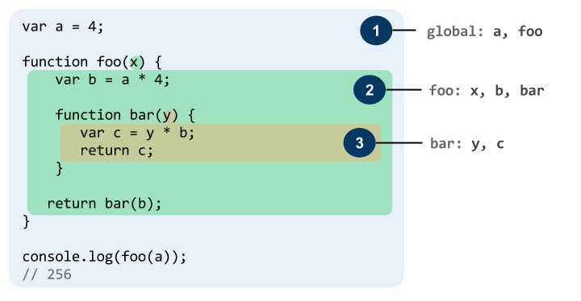
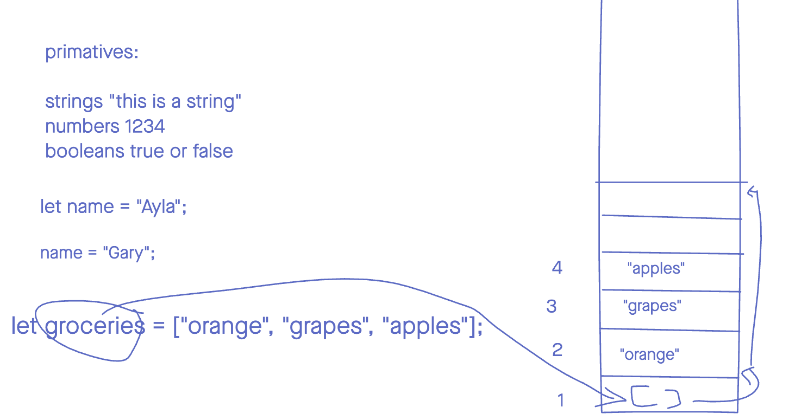

# To Anyone Reading This
- I've tried to cut out the technical langue used on the Mozilla site but in doing so, some points might not be 100% accurte. I recomend the "Read More" links if you want a thorough explination / examples. If there isn't a "Read More" for what you're looking at, check the catagory "[RM]" section. (Ex: The strings [RM] when wanting to look up `.toLowerCase()`) 

- Anything with a read more secotion has optional arguments or can be used in multiple ways.

# Strings [[RM]](https://developer.mozilla.org/en-US/docs/Web/JavaScript/Reference/Global_Objects/String)


```js
let stringName = "hello world";
```

## Properties
- `.length`: Returns the legth of the string.

## Methods
- `.toLowerCase()`: Returns the given string but converted to lower case.
- `.toUpperCase()`: Returns the given string but coverted to upper case.
- `.split(parameter)`: Splits what's in the string into an array, and returns the array.  The division is done by searching for a pattern provided as an argument. [Read More](https://developer.mozilla.org/en-US/docs/Web/JavaScript/Reference/Global_Objects/String/split)
- `.concat(" ", string)`:  Combines the initial string and the arguments into a single new string and returns that string. [Read More](https://developer.mozilla.org/en-US/docs/Web/JavaScript/Reference/Global_Objects/String/concat)
- `.includes(string)`: Method performs a case-sensitive search to determine whether the string provided can be found witin the initial one. Returning true or false as appropriate. [Read More](https://developer.mozilla.org/en-US/docs/Web/JavaScript/Reference/Global_Objects/String/includes)
- `.replace(subString, newSubstring)`: Returns a copy of the given string with the first instance of the `subString` being replaced by the `newSubString`. The original string is left unchanged. [Read More](https://developer.mozilla.org/en-US/docs/Web/JavaScript/Reference/Global_Objects/String/replace)
- `.replaceAll(subString, newSubstring)`: Returns a copy of the given string with the all instances of the `subString` being replaced by the `newSubString`. The original string is left unchanged. [Read More](https://developer.mozilla.org/en-US/docs/Web/JavaScript/Reference/Global_Objects/String/replaceAll)
- `.slice(beginIndex, endIndex)`: Creates and returns a new string that is made up of a portion of the original string. Starting from the `beginIndex` value through the `endIndex` value. This does not change the original string. [Read More](https://developer.mozilla.org/en-US/docs/Web/JavaScript/Reference/Global_Objects/String/slice)


# Arrays [[RM]](https://developer.mozilla.org/en-US/docs/Web/JavaScript/Reference/Global_Objects/Array)

```js
let arrayName = [];
```


## Properties
- `.length`: Retruns the length of the array. 


## Methods
- `.push(element)`: Adds an element to the end of an array [Read More](https://developer.mozilla.org/en-US/docs/Web/JavaScript/Reference/Global_Objects/Array/push)

- `.pop()`: Removes the last element from an array and returns that element. This method changes the length of the array.

- `.unshift(element)`: Adds one or more elements to the beginning of an array and returns the new length of the array. [Read More](https://developer.mozilla.org/en-US/docs/Web/JavaScript/Reference/Global_Objects/Array/unshift)

- `.shift()`: Removes the first element from an array and returns that removed element. This method changes the length of the array.

- `.slice(startIndex, stopIndex)`: Returns a copy of part of an array from `startIndex` to `stopIndex` of the initial array. The origianl array will not be modified. [Read More](https://developer.mozilla.org/en-US/docs/Web/JavaScript/Reference/Global_Objects/Array/slice)

- `.splice(start, numDeleting, item, ...)`: Changes the contents of an array by removing or replacing existing elements and/or adding new elements in place. [Read More](https://developer.mozilla.org/en-US/docs/Web/JavaScript/Reference/Global_Objects/Array/splice)

- `.indexOf(element)`: Returns the first index at which a given element can be found in the array, or -1 if it is not present. [Read More](https://developer.mozilla.org/en-US/docs/Web/JavaScript/Reference/Global_Objects/Array/indexOf)

- `.lastIndexOf(element)`: Returns the last index at which a given element can be found in the array, or -1 if it is not present. The array is searched backwards, starting at fromIndex. [Read More](https://developer.mozilla.org/en-US/docs/Web/JavaScript/Reference/Global_Objects/Array/lastIndexOf)

- `.includes(element)`: Determines if an array includes a certain value among its entries, returning true or false as appropriate. [Read More](https://developer.mozilla.org/en-US/docs/Web/JavaScript/Reference/Global_Objects/Array/includes)

- `.reverse()`: Reverses an array in place. The first array element becomes the last, and the last array element becomes the first.

- `.join(" ")`: creates and returns a new string by combining all of the elements in an array (or an array-like object), separated by the argument provided. If the array has only one item, then that item will be returned without using the separator. [Read More](https://developer.mozilla.org/en-US/docs/Web/JavaScript/Reference/Global_Objects/Array/join)

- `.sort()`: Sorts the elements of an array in place and returns the sorted array. The default sort order is ascending, built upon converting the elements into strings, then comparing their sequences of UTF-16 code units values. [Read More](https://developer.mozilla.org/en-US/docs/Web/JavaScript/Reference/Global_Objects/Array/sort)

- `.forEach(function(element){...});`: Executes a provided function once for each array element. [Read More](https://developer.mozilla.org/en-US/docs/Web/JavaScript/Reference/Global_Objects/Array/forEach)

- `.filter(function(element){...});`: Creates a new array out of every element of the initial array that pass the test given by the provided function. [Read More](https://developer.mozilla.org/en-US/docs/Web/JavaScript/Reference/Global_Objects/Array/filter)

- `.map(function(element){...});`: Creates a new array that contains every elemnt of the initial array after being passes through the provided function. An example being if you wanted to multiply everythig in the initial array by 2. [Read More](https://developer.mozilla.org/en-US/docs/Web/JavaScript/Reference/Global_Objects/Array/map)

- `.reduce()`: Reduce an array into a single value. The single value can be a number, object, array, or anything. [Read More](https://developer.mozilla.org/en-US/docs/Web/JavaScript/Reference/Global_Objects/Array/Reduce).

- `.find(function(element){...});`: Find an element within an array. [Read More](https://developer.mozilla.org/en-US/docs/Web/JavaScript/Reference/Global_Objects/Array/find)

- `.findIndex(function(element){...});`: Returns the found element's index. Note that this is usually used to find the index of an object. [Read More](https://developer.mozilla.org/en-US/docs/Web/JavaScript/Reference/Global_Objects/Array/findIndex)

- `.some(function(element){...});`: Checks to see if the array has at least one element that meets a certain condition. [Read More](https://developer.mozilla.org/en-US/docs/Web/JavaScript/Reference/Global_Objects/Array/some)

- `.every(function(element){...});`: Check if every element in the array meets a certain condition. [Read More](https://developer.mozilla.org/en-US/docs/Web/JavaScript/Reference/Global_Objects/Array/every)


<br />
<br />

# Control Flow [[RM]](https://developer.mozilla.org/en-US/docs/Web/JavaScript/Reference/Statements)
- `break;`: Terminates the current loop, switch, or label statement and transfers program control to the statement following the terminated statement.
- `continue;`: Terminates execution of the statements in the current iteration of the current or labeled loop, and continues execution of the loop with the next iteration.

```js
// For Loop 
for(let i=0; i<10; i++){ }
``` 
```js
//While Loop
let i=0;
while(i<=10){
	i++
}
```

```js
// Do While Loop
let i=0;
do{
	i++
} while (i <=10);
```
```js
// If
let i=0;
if(i === 1){
	
} /* Else If */ 
else if (i === 2) {

} //Else
else {

}
```

```js
// Ternary Operator 
// ? when used like this, will retrun the first thing after the ? if the statement befoe is true.
// will return the statement after the : if it isn't.
let message = score > 100 ? "You rock!" : "Keep trying!"

//The above is bascially saying this:
let message;
if(score > 100){
	message = "you rock!"
}
else{
	message = "Keep trying!"
}

// Another Exacmple (taken from #5 of the JS functions Lab)
total = i === 0 ? array[i] : total*array[i];

```

```js
//Switch Statment
// Switch statments evaluates an expression, matching the expression's value to a case clause.
// Then executing statements associated with that case, as well as statements in cases that follow the matching case.
let yourVariable = 5;
switch (yourVariable) {
  case 0: // you can put anything here
    console.log('Your variable is 0');
    break;
  
  case 5: 
    console.log('Your variable is 5');
    break;

  default:
    console.log(`Your variable doesn't match`);
}
```


# Functions [[RM]](https://developer.mozilla.org/en-US/docs/Web/JavaScript/Reference/Global_Objects/Function)
- `arguments`: can be called within a function/method to access the aruments and other properties such as`arguments.length`. [Read More](https://developer.mozilla.org/en-US/docs/Web/JavaScript/Reference/Functions/arguments)


## Different Types of Functions
Function Decloration
```js
function sayHello(name) { }
```
Function declorations can be called before the function is defined. 

Function Expression
```js
const sayHello = function(name){ };
```
Function Expressions need to be above any calls for the funtion in order for them to work. 

Arrow Function
```js
const add = (a, b) => a + b;

// The same but a Function Declaration
function add(a, b) {
  return a + b;
}
```
All arrow functions are Function Expressions. [Ream More](https://developer.mozilla.org/en-US/docs/Web/JavaScript/Reference/Functions/Arrow_functions)

`Paramaters`: are the placeholders for inputs the function should recieve.

`Arguments`: are the specific values of the inputs we give the function when it's called. 


# Scope
- `Global scope`: There's always a single global scope which lives at the top of the scope chain. Variables innitialized can be called from from anywhere.
- `Local/Function scope`: Every time a function runs, it creates its own scope. Variable innitialized here can be called only from inside the `{ }`where it was innitialized or within any `{}`'s contained within the original.
- `Block scope`: This scope is courtesy of ES2015's `let` & `const` keywords and in general, defines a scope within a code block defined using curly braces.



In the example above
- var a can be accessed anywhere.
- var b can be accessed by foo() and bar()
- var c can only be accessed by bar()

<br />
<br />

# Objects
Javascript classifies these as Ojbects:
- Arrays 
- Objects 
- Function
- RegEx
- Date

Objects we create: 
```js

//Object Literal Syntax
const player = {
	score: 0,
	lives: 3,
	health: 100
};

//to call any of these properties
//Dot Notation
console.log(player.score);

//Bracket Notation
console.log(player['lives']);


//Another way to create an object
const me = Object.create(person);
```
[More](https://developer.mozilla.org/en-US/docs/Web/JavaScript/Reference/Global_Objects/Object/create) on creating an object with `Object.create()`


# Classes

# Javascipt "Theory"
(For anyone actually using this I'll probably move this section to it's own thing eventually but for now I'm just going to leave this here.)


Functions in javascript are a callable objects


## Const and Objects
Objects in javascript are like hashmaps and hashtables in other programming languages.

<br />

We can change variabls and values within objects even if they are constant

When innitalizing an object as a const we can change the variables or data within the object without running into errors. This is because the object itself, when initialized, is refering to a pointer we created in the memory. This pointer lets the computer know where the other variables or data is but the actual value is still remaing constant. 


